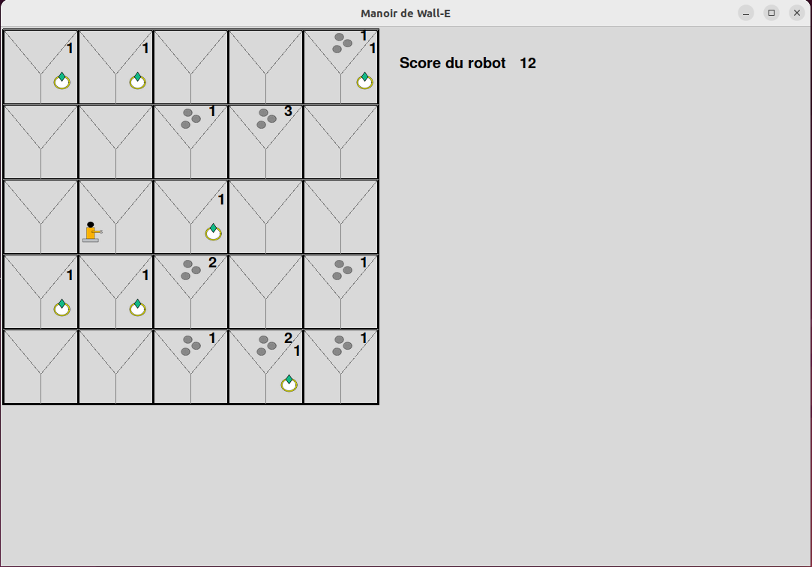
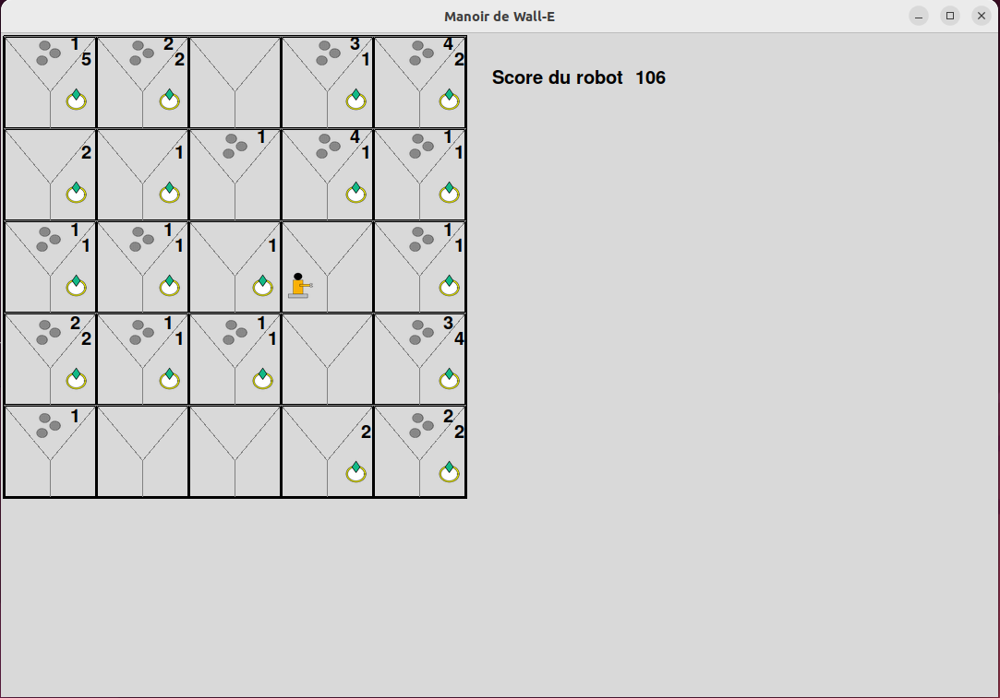

# Hi, that's the Wall_e project
An intelligent agent based on this principe: Capture, Find a path, Just Do It.

## Some photos and video

## Dépendances
Le projet utilise deux bibliothèques pour l'affichage graphique:
- Tkinter
- PIL

### Installation sur linux
Installer les paquets depuis votre gestionnaire de paquets, pour Ubuntu:
`sudo apt install python3 python3-tk python3-pil`

Ou vous pouvez utiliser `pip`:
`pip install tk pil`

### Installation sur Windows
Pour windows utiliser la méthode pip vu au-dessus.

Sinon vous pouvez l'obtenir en téléchargeant Anaconda.

## Lancer le programme
Vous devez lancer le fichier `../wall-e/main.py` avec python pour exécuter notre programme.
/!\ Vous devez l'exécuter depuis le dossier `wall-e` pour des raisons de path. /!\
/!\ Modifier le chemin des images avec votre chemin dans les fichiers `../wall-e/objet_element/aspirateur.py ../wall-e/objet_element/bijoux.py ../wall-e/objet_element/poussiere.py`. Vous trouverea un exemple de chemin Linux qui n'est pas nécessaire de changer si vous êtes sous Linux, un chemin de Windows qui est nécessaire de changer si vous êtes sous windows. Mais les informaticiens sont sous Linux donc pas de problèmes ... :) /!\

Sous Linux: `python3 main.py`
Sous windows: double clic dessus